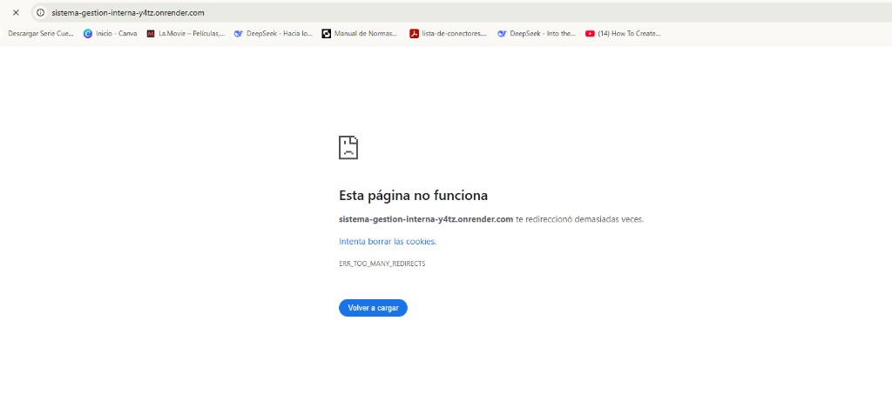
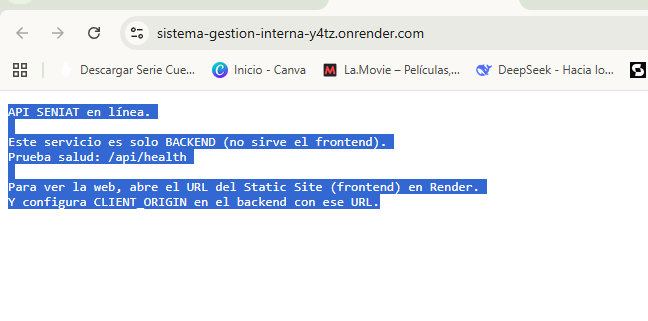

## Manual de usuario (simple)

Este manual explica, de forma **sencilla**, cómo usar el **Sistema de Gestión Interna**.

### 1) Ingresar al sistema

- Abre el enlace del sistema en tu navegador.
- Escribe tu **correo** y **contraseña**.
- Presiona **Iniciar sesión**.

### 2) Menú principal

- En el menú verás los módulos disponibles según tu usuario, por ejemplo:
  - **Inicio**
  - **Correspondencia**
  - **Bienes nacionales**
  - **POA**
  - **Máquinas fiscales**
  - **Reenajenación**

### 3) Correspondencia

- **Enviada**: crea y consulta memos/correspondencias enviadas.
- **Recibida**: revisa lo que llega a tu bandeja y gestiona según permisos.

### 4) Bienes nacionales

- Registra bienes, actualiza información y usa los filtros para buscar.
- Puedes exportar listados en **PDF** y **Excel** (según el módulo).

### 5) POA (Plan Operativo Anual)

- **Planificación (Admin)**: crea objetivos y actividades.
- **Ejecución (Operador)**: registra ejecuciones con su respaldo en PDF.
- Si una actividad fue marcada como **carga múltiple**, el operador puede subir **un solo PDF resumen** e indicar la **cantidad de tareas** realizadas.

### 6) Máquinas fiscales (Desincorporación / Reenajenación)

- **Desincorporación**:
  - Registra máquinas.
  - Marca como **Listo** cuando una máquina o un lote ya está desincorporado.
- **Reenajenación**:
  - Trabaja por **máquina individual**.
  - El **N° de registro** viene por defecto (serial) y no se edita.

### 7) Consejos rápidos

- Si no ves un módulo, es porque tu usuario no tiene permiso.
- Usa filtros antes de exportar para obtener reportes más precisos.

### Imágenes de referencia

> Imágenes guardadas en `frontend_asdrubal-main/imagen/`.

**Ejemplo de error por redirección (producción mal configurada):**

**Página informativa del backend (cuando no está sirviendo el frontend):**

